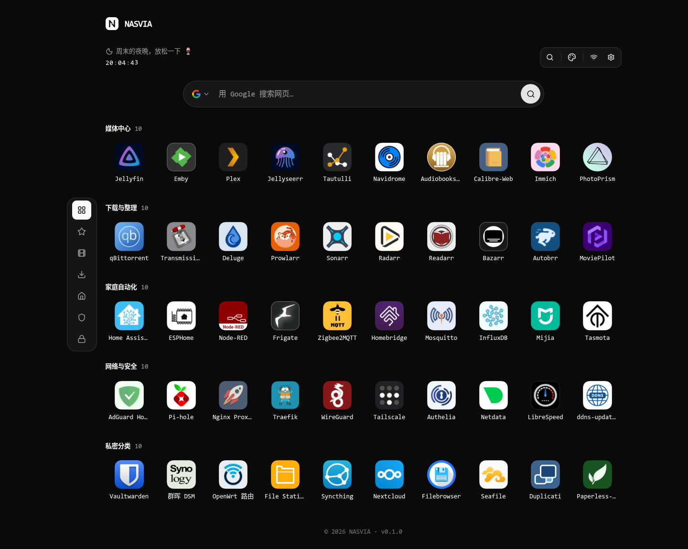
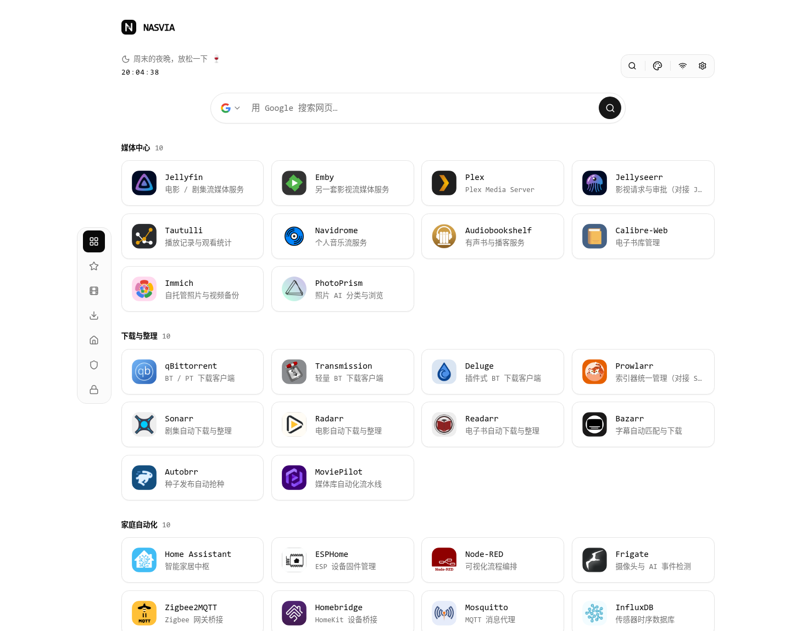
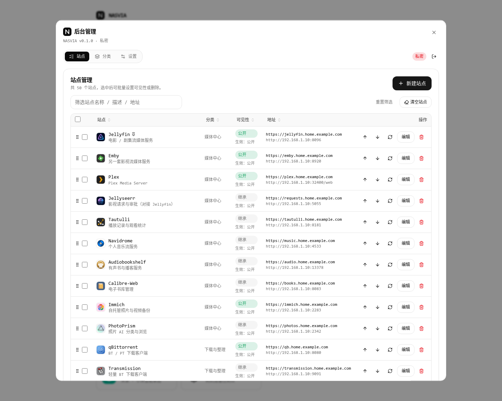
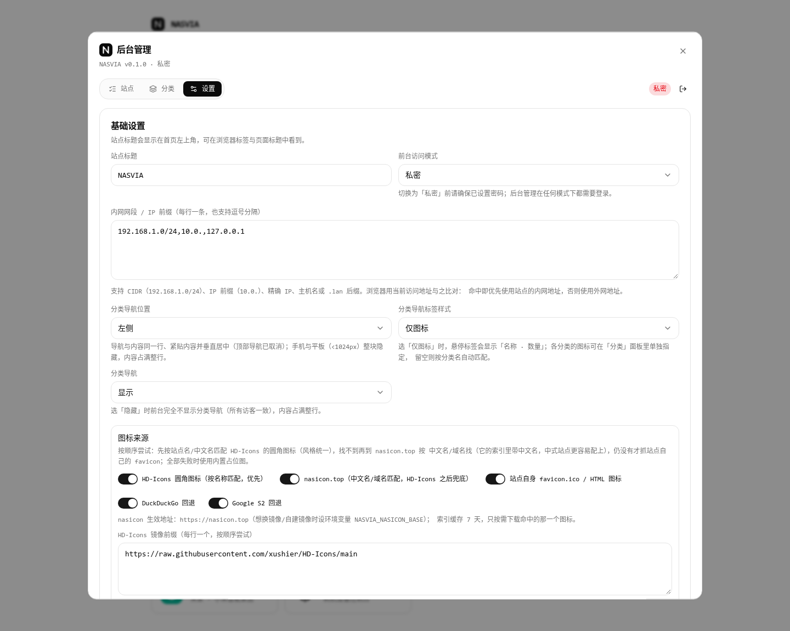
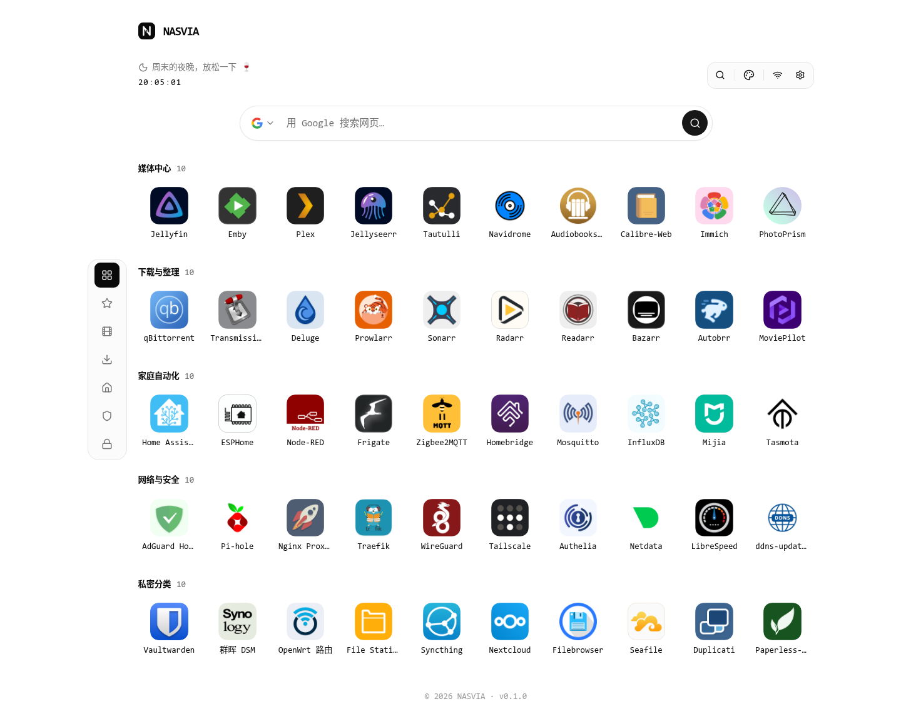
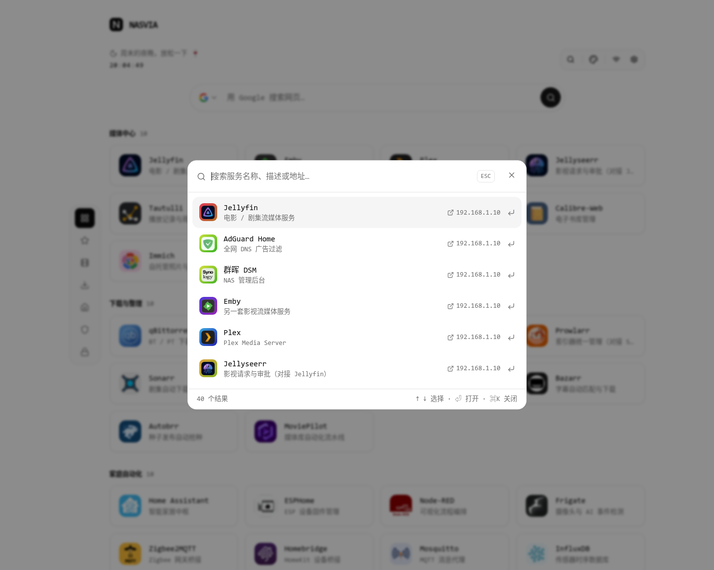

# NASVIA — NAS 个人服务导航页

轻量、快速、单文件存储的个人服务导航页：自动抓取图标、⌘K 全局搜索、内外网地址自动切换、公开/私密访问模式 + 分类与站点级可见性。

后端 **Go + Gin + GORM（纯 Go SQLite）** 单二进制，前端 **React 19 + Rsbuild + Tailwind CSS 4** 用 `go:embed` 内嵌——**一个文件、一个进程、一个 SQLite 文件**，拷走 `data/` 即可迁移。默认端口 **3720**。

## 功能

- **站点与分类**：分类增删改查 / 排序 / 可见性 / 图标（手选，或留空按分类名自动匹配）；站点含名称、描述、外网地址、内网地址、图标、标签、置顶、可见性。
- **自动抓图标**：服务端后台抓取并缓存到 `data/icons/`，优先按站点名匹配 HD-Icons 圆角图标 → nasicon.top → 站点 favicon（DuckDuckGo / Google S2 回退）→ 内置占位图，全程不阻塞接口。
- **后台可视化**：登录与后台都是弹窗；站点表格点击表头排序、拖动整行排序、内联编辑、批量操作、重抓图标；另有分类面板与设置面板。
- **⌘K 全局搜索**：按名称 / 描述 / 地址 / 标签匹配，↑↓ 选择、回车打开；未登录时结果不含任何私密站点。工具栏下方还有常驻的**联网搜索框**（回车在新标签页打开 Google / Bing / 百度的结果页，引擎图标随前端一起打包）。
- **内外网自动切换**：后台配置内网网段，浏览器零延迟判定，命中则使用内网地址。
- **三种视图**：应用图标网格（**默认**）、卡片视图与紧凑列表，切换收在右上角主题菜单里（与深色/浅色同一栏），选择存在浏览器 `localStorage`。
- **访问控制**：前台模式 `public` / `private`；分类 + 站点两级可见性（公开 / 私密 / 继承），**分类是可见性的上限**，未登录访客完全感知不到私密内容。
- **体验细节**：深色 / 浅色 / 跟随系统三态主题（防闪白）、实时时钟 + 按 9:00–12:00 / 14:00–17:30 上班节奏分段的问候语（周末与工作日各一套文案）、分类导航（左侧 / 右侧，**默认仅图标**，文字模式最多显示两个汉字，<1280px 隐藏且不挤占主内容）、分类导航可在后台一键隐藏、响应式手机可用。
- **数据存储**：`data/nasvia.db`（单文件）+ `data/icons/`（图标缓存），备份迁移只需复制 `data/`。

## 界面预览

截图取自**全新实例自带的演示数据**：**5 个分类 / 50 个站点，每分类 10 个**（媒体中心、下载与整理、家庭自动化、网络与安全为公开，另加一个「私密分类」），其中 3 个置顶；匿名访客共可见 40 个，50 个图标**全部**命中 HD-Icons / nasicon。删掉 `data/nasvia.db` 重启即可重新播种（已在后台清空过站点或分类的实例**不会**复活演示数据）。

| 首页 · 应用图标视图（深色，**默认视图**） | 首页 · 卡片视图（浅色） |
| --- | --- |
|  |  |

| 站点管理（后台） | 设置（后台） |
| --- | --- |
|  |  |

| 首页 · 左侧图标导航（浅色） | ⌘K 全局搜索 |
| --- | --- |
|  |  |

## 快速开始

**Docker Compose（推荐）**

```bash
git clone https://github.com/oner8/nasvia.git nasvia && cd nasvia
cp .env.example .env          # 修改 NASVIA_PASSWORD / NASVIA_LAN_CIDRS
docker compose up -d --build
# 打开 http://<NAS 地址>:3720
```

**裸机**

```bash
cd web && npm ci && npm run build && cd ..                       # 构建前端
CGO_ENABLED=0 go build -trimpath -ldflags="-s -w" -o bin/nasvia ./cmd/nasvia
NASVIA_PASSWORD='你的密码' NASVIA_LAN_CIDRS='192.168.1.0/24' ./scripts/start.sh
```

**systemd**

```bash
sudo useradd --system --home /opt/nasvia --shell /usr/sbin/nologin nasvia
sudo mkdir -p /opt/nasvia && sudo cp bin/nasvia /opt/nasvia/ && sudo chown -R nasvia:nasvia /opt/nasvia
sudo cp deploy/nasvia.service /etc/systemd/system/
sudo cp .env.example /opt/nasvia/.env   # 填好密码后
sudo systemctl daemon-reload && sudo systemctl enable --now nasvia
```

**群晖 Synology（Container Manager）**：把仓库放进 `/volume1/docker/nasvia` → Container Manager → **项目** → 新增 → 来源选 `docker-compose.yml` → 环境变量填 `NASVIA_PASSWORD` / `NASVIA_LAN_CIDRS`，以及 `PUID` / `PGID`（SSH 里 `id <用户名>` 查看，常见 `1026` / `100`），端口保持 `3720:3720`，数据卷指向 `/volume1/docker/nasvia-data:/data`（容器启动时会自动把该目录属主修正为 `PUID:PGID`，无需手动 `chmod`）。

**威联通 QNAP（Container Station 3）**：把仓库放进 `/share/Container/nasvia` → Container Station → **应用程序** → 创建 → 粘贴 `docker-compose.yml` 内容（或 SSH 进目录执行 `docker compose up -d --build`），数据卷改为 `/share/Container/nasvia-data:/data`，`PUID` / `PGID` 同样用 `id <用户名>` 查看（普通用户常见 `1000` / `100`）。

> **NAS 上直接构建镜像的注意事项**：x86 与 ARM（arm64 / armv7）机型都可以本机构建，产物自动匹配本机架构；构建需要拉取 Docker Hub 镜像与 Go / npm 依赖，国内网络请在 `.env` 里设置 `GOPROXY=https://goproxy.cn,direct`、`NPM_REGISTRY=https://registry.npmmirror.com`，并为 Docker 配好镜像加速；内存 ≤1GB 的机型构建前端可能较慢或失败，可在电脑上 `docker build` 后 `docker save nasvia:latest | gzip > nasvia.tar.gz`，再到 NAS 上 `docker load` 导入（电脑与 NAS 架构不同时用 `docker buildx build --platform linux/arm64 ...`）。

**Unraid**：Docker → Add Container，端口 `3720` → `3720/tcp`，路径 `/mnt/user/appdata/nasvia` → `/data`（读写），变量 `NASVIA_PASSWORD`、`NASVIA_LAN_CIDRS`、`NASVIA_AUTH_MODE`，以及 `PUID=99`、`PGID=100`（Unraid 默认的 nobody:users），然后打开 `http://<Unraid IP>:3720`。

## 配置

环境变量（首次启动写入数据库，之后以后台「设置」里的值为准）：

| 变量 | 默认值 | 说明 |
| --- | --- | --- |
| `NASVIA_PORT` | `3720` | 监听端口 |
| `NASVIA_BIND` | `0.0.0.0` | 监听地址（建议设为 NAS 的局域网 IP） |
| `NASVIA_DATA_DIR` | `./data` | 数据目录（容器内 `/data`） |
| `NASVIA_DB_PATH` | `<数据目录>/nasvia.db` | 数据库文件路径 |
| `NASVIA_PASSWORD` | 空 | 后台密码；**未设置时后台接口返回 403 `password_not_set`** |
| `NASVIA_AUTH_MODE` | `public` | 前台模式：`public`（任何人可浏览公开服务）/ `private`（首页也需登录） |
| `NASVIA_LAN_CIDRS` | `192.168.0.0/16,10.0.0.0/8,*.lan,*.local,home.arpa` | 内网网段（`localhost` / `127.0.0.1` 访问固定视为内网，无需配置） |
| `NASVIA_HOME_EGRESS` | 空 | 家庭公网出口：DDNS 域名 / `auto` / 公网 IP / CIDR，经反代用域名访问时据此区分在家 / 在外（见下文） |
| `NASVIA_TRUSTED_PROXIES` | 私网与本机网段 | 允许其 `X-Forwarded-For` 生效的反代地址（CIDR / IP，逗号分隔） |
| `NASVIA_SITE_TITLE` | `NASVIA` | 首页标题 |
| `NASVIA_FAVICON_SOURCES` | `hdicons,nasicon,site,duckduckgo,google` | 图标来源与顺序；只留 `site` 可完全离线 |
| `NASVIA_NASICON_BASE` | `https://nasicon.top` | nasicon 站点地址（可换镜像） |
| `NASVIA_HDICONS_MIRRORS` | `https://raw.githubusercontent.com/xushier/HD-Icons/main` | HD-Icons 镜像前缀（国内常需换 jsDelivr / gh-proxy，可在后台改并测连通性） |
| `PUID` / `PGID` | `10001` / `10001` | 仅 Docker：服务运行身份；启动时自动把数据目录属主修正为它（用 `user:` 覆盖时跳过修正，需自行保证目录可写） |

后台「设置」里的项（存数据库，不走环境变量）：

| 键 | 默认 | 说明 |
| --- | --- | --- |
| `nav_position` | `left` | 分类导航位置：`left` / `right`，使用主内容两侧留白且不占用内容宽度；<1280px 不显示。历史值 `top` 按 `left` 读取（接口不再接受，400） |
| `nav_style` | `icon` | 标签样式：`icon`（**默认**，只显示图标，悬停显示「名称 · 数量」）/ `text`（显示分类名，**最多两个汉字**，完整名走悬停提示） |
| `nav_visible` | `show` | 是否显示分类导航：`show` / `hide`（后台统一控制，所有访客一致） |
| `category.icon` | 空 | 分类图标键；留空表示按分类名自动匹配 |

## 内外网地址自动切换

后台「设置 → 内网网段」每行一条（也支持逗号分隔）：`192.168.1.0/24`（CIDR）、`10.0.`（IP 前缀）、`192.168.1.10`（精确 IP）、`home.arpa` / `.lan` / `*.lan`（主机名精确 / 后缀）、`fd00:`（IPv6 前缀）。新实例默认写入常用网段 `192.168.0.0/16`、`10.0.0.0/8`、`*.lan`、`*.local`、`home.arpa`（已有实例可点「填入常用网段」追加）；用 `localhost` / `127.0.0.1` 访问固定视为内网。默认不含 `172.16.0.0/12`：Docker 网桥网关也在这个段里，端口映射走用户态代理时会把外网直连误判为内网，家里确实用这个段时再手动添加。

浏览器的访问地址（`window.location.hostname`）与服务端看到的访客 IP **任一命中**即用「内网地址」，否则用「外网地址」，缺其中一个时自动回落另一个。右上角徽标显示当前模式，悬停仅提示「内网」或「外网」；判定配置与解析状态集中在后台「设置」。

### 经反代 / 内网穿透用域名访问（在家判内网、在外判外网）

典型部署：NAS 在家 → WireGuard 穿透到云服务器 → Nginx Proxy Manager 反代成 `https://nav.example.com`。此时在家、在外地址栏都是同一个域名，**只看地址栏无法区分**；但反代看到的来源 IP 不同——在家时是家里宽带的公网出口 IP。做法：

1. 后台「设置 → 家庭公网出口」填家里的 **DDNS 域名**（如 `nas.example.com`，每 5 分钟重新解析），或填 `auto`（NAS 自动探测自己的公网出口 IP），也可填固定公网 IP / CIDR。在家访问时访客 IP 等于它，即判为内网。
2. 反代要把真实 IP 放进 `X-Forwarded-For`：Nginx Proxy Manager 默认已传，无需改动。NASVIA 默认只信任来自私网 / 本机的该请求头（WireGuard 隧道、Docker 网桥都在其中），公网直连伪造的一律忽略；反代地址不在私网时用 `NASVIA_TRUSTED_PROXIES` 指定。
3. **不要**把反代域名写进「内网网段」，否则在外面也会判成内网。
4. 浏览器若开着代理（Clash 等）访问该域名，反代看到的是代理出口 IP，请让该域名直连。IPv6 访问时按访客地址与家里 IPv6 前缀（/64）比对。

家里若对该域名做了 DNS 分流（直接解析到 NAS 局域网 IP），访客 IP 就是局域网 IP，按「内网网段」即可命中。NASVIA 自身不处理 TLS，证书交给反代。

## 访问控制

| 前台模式 | 首页 | 后台 | 访客能看到什么 |
| --- | --- | --- | --- |
| 公开 `public` | 任何人可打开 | 仍需密码 | 只有公开的服务 |
| 私密 `private` | 需要登录 | 需要密码 | 登录后看到全部服务 |

后台管理在任何模式下都需要密码登录；未设密码时后台接口返回 `403 {"code":"password_not_set"}`。

可见性判定**由服务端强制执行**（不是前端藏起来）：

1. **分类是可见性的上限**：分类为私密时，其下站点（即使站点自身是公开）对访客一律不可见；后台也不允许这样配置——返回 `400 {"code":"public_in_private_category"}`，界面上下拉对应选项置灰。
2. 站点显式私密 → 一定不可见；站点「继承」（默认）→ 跟随所属分类；站点公开或继承且无分类 → 视为公开（仍受第 1 条约束）。
3. 未登录访客对私密内容完全感知不到：不出现在站点列表、搜索结果、分类计数、接口响应与页面 JSON 中，图标接口返回 404。
4. 登录后过滤自动解除（同一个接口，只看身份）。

## 图标来源与回退

新增站点或改地址后，服务端在后台按顺序抓取（单站点去重、最多 4 并发、不阻塞接口）：

1. **HD-Icons 圆角图标**：按站点名 / 中文名匹配 [xushier/HD-Icons](https://github.com/xushier/HD-Icons) 的 `border-radius/`（1024×1024，**MIT**），风格统一。
2. **nasicon.top**：HD-Icons 未命中时到 [nasicon.top](https://nasicon.top/)（上游 [Garry-QD/FlatNas](https://github.com/Garry-QD/FlatNas)，图标资源未标注许可）按中文名 / 英文名 / 域名匹配，中式服务更容易配上。
3. 站点自身 `/favicon.ico` → 首页 `<link rel="icon">` → DuckDuckGo → Google S2。
4. 全部失败 → 内置自绘占位图（名称首字母 + 确定性渐变色）。

- 来源可在后台逐个关闭；**只留「站点自身」时全程不访问第三方**，适合离线环境。两者索引分别缓存在 `data/hdicons.json`（约 1800 条）与 `data/nasicon.json`，7 天有效，源不可达时用旧缓存继续匹配。
- 匹配**刻意保守，全程不做模糊/包含匹配**：只接受完全同名 / 同名-数字、严格多词匹配（token 全被覆盖）或域名标签兜底，所以「百度网盘」能配上 `baidu-drive-1`，而「File Station」不会被配成 File Browser。
- **配不到就手动指定**：站点表单的「图标」行可搜 HD-Icons 与 nasicon 索引（支持中文关键词，带缩略图），也支持直接填 `nasicon:<文件名>`；留空即回到自动匹配，索引里没有的名字返回 400 `unknown_icon`。
- 图标以**内容哈希**命名缓存在 `data/icons/`（不可枚举），私密站点的图标接口做可见性校验；重新抓取点站点行的「↻」。
- 抓取期间前端只批量查询待处理站点的轻量图标状态，并从 2 秒逐步退避到 5 秒、10 秒；不会反复下载完整站点与分类列表，页面隐藏时暂停。
- 落盘前会自动裁掉网页截图图标最外圈的 1px 单色细边（最多 3px，仅 PNG）：自带底色的圆角方块、白底方图、四周留透明的 favicon 不会被误裁。
- 图标自带底色的（HD-Icons / nasicon / 占位图）前端直接铺满，只有 favicon 才补一层灰底衬托。
- **省流量、加载快**：落盘前把大图（HD-Icons 原图 1024px，单张可达 300KB）等比缩到 192px（通常十几 KB），旧版本存下的大图升级后启动时自动就地缩小；图标地址带内容版本（`?v=哈希`），浏览器长期缓存，再次打开首页不再为图标发任何请求，图标更新后地址随之改变。
- 图标响应带沙箱 CSP：远程抓来的 SVG 即使被直接打开也不能执行脚本。

## 键盘快捷键

| 快捷键 | 作用 |
| --- | --- |
| `⌘K` / `Ctrl+K`（或 `/`） | 打开全局搜索面板（名称、描述、地址模糊匹配） |
| `↑` `↓` / `Enter` / `Esc` | 上下选择 / 打开选中的服务（新标签页）/ 关闭面板与弹窗 |
| 联网搜索框 | 输入关键词回车 → 新标签页打开所选引擎（Google / Bing / 百度）结果页；引擎选择记在浏览器本地 |
| 工具栏最右按钮 | 未登录是**登录图标**、登录后是**齿轮（后台管理）** |
| 站点卡片 | 点击在新标签页打开当前网络应使用的地址 |

## 数据备份与迁移

数据都在**一个目录**里：`data/nasvia.db` + `data/icons/`。

```bash
# 方式一：SQLite 原生备份（运行中也安全）
sqlite3 data/nasvia.db ".backup 'nasvia-backup-$(date +%F).db'"

# 方式二：目录整体拷贝（先停服务最稳妥）
docker compose stop nasvia && tar czf nasvia-data-$(date +%F).tar.gz data/ && docker compose start nasvia

# 方式三：从容器里拷出来 / 拷回去
docker cp nasvia:/data/nasvia.db ./nasvia.db
docker cp ./nasvia.db nasvia:/data/nasvia.db   # 恢复
```

迁移到新机器：把 `data/` 放到新机器的数据目录（或 compose 卷）再启动即可，配置、密码、图标缓存全部随行。运行期间数据库只有 `nasvia.db` 一个文件（未启用 WAL），所以 `cp` 也是安全的备份方式。

## 开发

```bash
CGO_ENABLED=0 go run ./cmd/nasvia      # 后端（终端 A，默认 3720）
cd web && npm install && npm run dev   # 前端开发服务器（终端 B，5180，代理 /api 到 3720）

node --test web/src/lib/*.test.ts      # 前端纯逻辑单测（Node 内置 runner，无需额外依赖）
go vet ./... && go test ./...          # Go 测试与静态检查
cd web && npm run typecheck            # 类型检查（可选）
```

```
cmd/nasvia/            程序入口
internal/config/       环境变量与命令行参数
internal/model/        数据模型与共享常量
internal/store/        GORM + 纯 Go SQLite 持久化、演示数据播种
internal/auth/         会话、bcrypt 密码、登录限速
internal/favicon/      图标抓取回退链、图片嗅探、占位图生成
internal/visibility/   服务端强制的可见性规则
internal/server/       Gin 路由、鉴权中间件、图标与静态资源服务
web/                   前端（React 19 + Rsbuild + Tailwind 4；src/lib 为纯逻辑含单测）
deploy/nasvia.service  systemd 单元示例
scripts/start.sh       裸机启动脚本
docs/screenshots/      README 用的界面截图（来自全新实例的演示数据）
```

主要接口：`/api/health`、`/api/config`、`/api/auth/login|logout`、`/api/sites`（含 `/:id/icon`、`/icon-status`）、`/api/categories`、`/api/suggest`（联网搜索联想），后台 `/api/admin/{sites,categories,settings,password,purge,hdicons/search}`。


## 许可证

[MIT](LICENSE)
